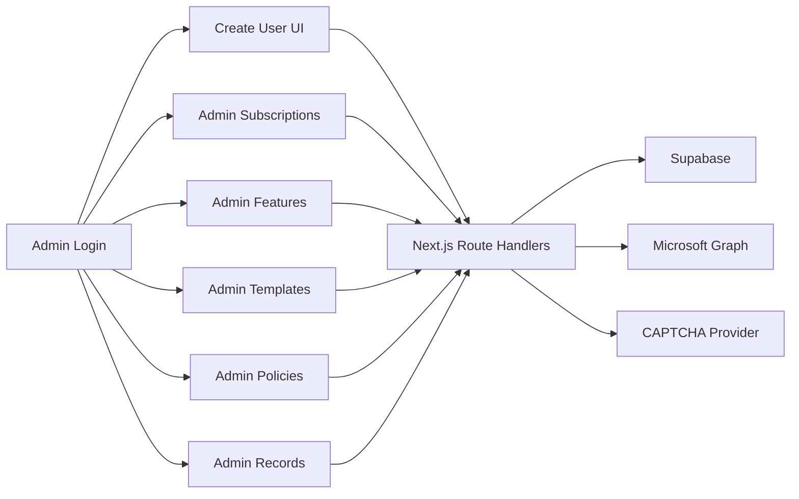

# Next.js Office User Provisioning Admin Design

## Summary

This document defines the redesign of the current Cloudflare Worker tool into a single Next.js application with:

- a protected user-creation frontend
- an admin backend for fine-grained license and application control
- Supabase as the primary database
- Microsoft Graph as the source of truth for subscription and service-plan data

The new system should allow an administrator to:

- create Microsoft 365 users
- choose a template, then fine-tune application capabilities
- control which subscriptions can be assigned
- control which applications a created user can use
- review records and operational history

## Goals

- Replace the current single-file Worker with a maintainable Next.js application.
- Keep the current core function of creating a Microsoft 365 user and assigning licenses through Microsoft Graph.
- Add a protected admin backend for:
  - subscription visibility
  - feature mapping
  - template management
  - assignment policies
  - records and logs
- Let the user-creation flow work from high-level feature choices rather than raw Graph service plan names.
- Support manual password entry and automatic password generation.
- Support optional CAPTCHA that can be turned off or switched between providers with environment variables.
- Cache Graph subscription data in Supabase and support both scheduled and manual refresh.

## Non-Goals

- Multi-role RBAC is out of scope for the first version.
- Microsoft Entra sign-in is out of scope for the first version.
- Direct browser access to Graph or Supabase privileged operations is out of scope.
- reCAPTCHA v3 is out of scope for the first version.
- End-user self-service is out of scope.

## Product Decisions

### Admin model

- The system supports either a single administrator or multiple administrators with identical privileges.
- No role hierarchy is introduced in v1.

### Authentication

- Admins log in with an application-managed username and password.
- The app issues a server-managed session cookie.
- All protected pages and APIs require an authenticated session.

### Data storage model

- Sensitive deployment secrets remain in environment variables.
- Business configuration and operational data are stored in Supabase.
- Microsoft Graph subscription data is synchronized into Supabase for browsing and previewing.

### Subscription visibility model

- The admin backend can see Graph-derived SKU and service-plan details.
- The user-creation frontend sees only curated templates and human-friendly feature items.

### User creation workflow

- The admin first selects a template.
- The template applies default feature selections.
- The admin can then fine-tune the feature set before creating the user.

### CAPTCHA

- CAPTCHA can be enabled or disabled by environment variable.
- The first version supports exactly these providers:
  - `turnstile`
  - `hcaptcha`
  - `recaptcha_v2`

## High-Level Architecture

The application is a single Next.js App Router project with server-side APIs and server-only access to privileged services.

## Environment Variables

### Required secrets and deployment configuration

- `AZURE_TENANT_ID`
- `AZURE_CLIENT_ID`
- `AZURE_CLIENT_SECRET`
- `SESSION_SECRET`
- `DEFAULT_USAGE_LOCATION`

### CAPTCHA configuration

- `CAPTCHA_ENABLED=true|false`
- `CAPTCHA_PROVIDER=turnstile|hcaptcha|recaptcha_v2`
- `CAPTCHA_SITE_KEY`
- `CAPTCHA_SECRET`

### Supabase

- `NEXT_PUBLIC_SUPABASE_URL`
- `NEXT_PUBLIC_SUPABASE_ANON_KEY`
- `SUPABASE_SERVICE_ROLE_KEY`

## Supabase Data Model

### `admins`

Stores administrator accounts.

Suggested fields:

- `id`
- `username`
- `password_hash`
- `is_active`
- `created_at`
- `updated_at`
- `last_login_at`

### `feature_definitions`

Stores curated frontend feature items.

Suggested fields:

- `id`
- `key`
- `name`
- `description`
- `is_enabled`
- `is_frontend_visible`
- `is_default_selected`
- `sort_order`
- `created_at`
- `updated_at`

### `feature_match_rules`

Stores mapping rules from a feature item to Graph service plans.

Suggested fields:

- `id`
- `feature_id`
- `match_type`
- `match_value`
- `created_at`
- `updated_at`

Where:

- `match_type` is one of `servicePlanName` or `servicePlanId`

### `license_templates`

Stores reusable bundles shown on the create-user page.

Suggested fields:

- `id`
- `key`
- `name`
- `description`
- `is_enabled`
- `sort_order`
- `created_at`
- `updated_at`

### `license_template_features`

Join table between templates and feature definitions.

Suggested fields:

- `id`
- `template_id`
- `feature_id`
- `created_at`

### `subscription_policies`

Controls which SKUs are eligible for assignment.

Suggested fields:

- `id`
- `sku_id`
- `sku_part_number`
- `is_assignable`
- `priority`
- `notes`
- `created_at`
- `updated_at`

### `service_plan_policies`

Controls service-plan behavior.

Suggested fields:

- `id`
- `sku_id`
- `service_plan_id`
- `service_plan_name`
- `is_frontend_selectable`
- `is_forced_keep`
- `is_forbidden`
- `created_at`
- `updated_at`

### `graph_subscriptions`

Caches synchronized Graph SKU data.

Suggested fields:

- `id`
- `sku_id`
- `sku_part_number`
- `capability_status`
- `applies_to`
- `enabled_units`
- `warning_units`
- `consumed_units`
- `available_units`
- `raw_payload`
- `synced_at`

### `graph_service_plans`

Caches synchronized Graph service-plan data.

Suggested fields:

- `id`
- `sku_id`
- `service_plan_id`
- `service_plan_name`
- `provisioning_status`
- `applies_to`
- `raw_payload`
- `synced_at`

### `graph_sync_jobs`

Tracks synchronization runs.

Suggested fields:

- `id`
- `status`
- `started_at`
- `finished_at`
- `error_message`
- `stats_payload`

### `provision_records`

Stores the full creation-time snapshot for each attempted user creation.

Suggested fields:

- `id`
- `admin_id`
- `display_name`
- `user_name`
- `mail_nickname`
- `user_principal_name`
- `usage_location`
- `template_id`
- `selected_feature_ids`
- `resolved_feature_snapshot`
- `selected_sku_id`
- `selected_sku_part_number`
- `kept_service_plans`
- `disabled_service_plans`
- `graph_user_id`
- `status`
- `error_message`
- `created_at`

### `audit_logs`

Stores lower-level operational and administrative events.

Suggested fields:

- `id`
- `admin_id`
- `action`
- `entity_type`
- `entity_id`
- `payload`
- `created_at`

## Graph Synchronization Strategy

### Purpose

Graph is the source of truth for:

- subscribed SKUs
- service plans contained in each SKU
- seat availability

Supabase stores synchronized copies for UI browsing and preview flows.

### Refresh policy

- Automatic synchronization runs every 14 days.
- The admin backend provides a manual refresh action.

### Runtime behavior

- Admin browsing and most preview screens read from Supabase cache.
- Final user creation performs a fresh validation step before assignment.
- Final assignment must not rely only on a 14-day-old cache.

### Sync workflow

1. Read Microsoft Graph `subscribedSkus`.
2. Normalize SKU and service-plan data.
3. Upsert SKU rows into `graph_subscriptions`.
4. Upsert service-plan rows into `graph_service_plans`.
5. Record the sync run in `graph_sync_jobs`.

## Frontend User-Creation Flow

### Page

- `/create-user`

### Inputs

- display name
- email prefix
- mail nickname
- usage location
- force password change at next sign-in
- password mode
  - manual entry
  - auto-generate
- template selection
- feature item multi-select
- optional CAPTCHA

### Flow

1. The authenticated admin opens the page.
2. The page loads enabled templates, visible features, current CAPTCHA settings, and preview context.
3. The admin selects a template.
4. The template preselects its default features.
5. The admin adjusts feature selections.
6. Each change triggers a preview request.
7. The preview result shows:
   - whether the combination is valid
   - which SKU is expected to be selected
   - which applications will be enabled
   - which features are currently unavailable
8. The admin completes CAPTCHA if enabled.
9. The admin submits the form.
10. The server performs final validation, creates the user, assigns the license, and writes records.

### Success result

The page should show:

- success state
- final email address
- initial password
- selected template
- selected SKU
- enabled application summary

### Failure modes

#### Pre-create failure

Examples:

- invalid form input
- invalid CAPTCHA
- no eligible subscription combination
- no remaining seats

#### Partial success

Examples:

- Graph user created successfully
- license assignment failed afterward

When this happens, the UI must still show:

- created identity details
- Graph user ID if available
- failure reason

## License Preview and Assignment Logic

### Feature resolution

The backend resolves selected feature IDs into a target service-plan set by reading:

- `feature_definitions`
- `feature_match_rules`

Each feature may resolve through either:

- `servicePlanName`
- `servicePlanId`

### Candidate SKU selection

A SKU is eligible only if:

- it is synchronized from Graph
- it is marked assignable in `subscription_policies`
- it has remaining seats
- it contains every target service plan
- it does not violate any forbidden service-plan policy

### SKU ranking

The default ranking is:

1. Prefer the SKU with the fewest extra enabled capabilities beyond the requested set.
2. Then prefer the SKU with higher admin-defined priority.
3. Then prefer the SKU with more available seats.

### Disabled plan calculation

For the selected SKU:

- keep service plans that were selected through frontend features
- keep service plans marked `is_forced_keep`
- disable all remaining service plans in that SKU

### Real-time validation behavior

The system should support both:

- real-time frontend combination checks
- final submit-time validation

This means:

- the preview API prevents obviously impossible combinations early
- the create-user API rechecks the final combination against current data

## CAPTCHA Behavior

### Enabled mode

When `CAPTCHA_ENABLED=true`:

- the frontend renders the selected CAPTCHA widget
- the backend verifies the token through a provider-specific implementation

### Disabled mode

When `CAPTCHA_ENABLED=false`:

- the frontend does not render CAPTCHA
- the backend skips CAPTCHA verification

### Provider abstraction

The application should expose a single server-side verification entry point:

- `verifyCaptchaToken(provider, token, remoteIp?)`

Supported providers:

- `turnstile`
- `hcaptcha`
- `recaptcha_v2`

## Admin Backend Pages

### `/admin/subscriptions`

Purpose:

- browse synchronized SKU and service-plan data
- inspect availability and sync freshness
- control which SKUs are assignable
- manually trigger a refresh

### `/admin/features`

Purpose:

- manage frontend-visible feature items
- manage their descriptions and sort order
- manage mappings to Graph service plans

### `/admin/templates`

Purpose:

- manage reusable template bundles
- define which features a template selects by default

### `/admin/policies`

Purpose:

- allow or deny specific SKUs
- mark service plans as selectable, forced, or forbidden
- define SKU priority

### `/admin/records`

Purpose:

- review complete provision records
- inspect who created what, with which template and feature combination
- inspect final resolved SKU and service-plan outcomes

### `/admin/settings`

Purpose:

- display deployment-level configuration summary
- show CAPTCHA status and provider
- show Graph connection health
- show default usage-location summary

This page displays operational summary only. It does not edit environment variables.

## Route Structure

### Public page

- `app/login/page.tsx`

### Protected pages

- `app/create-user/page.tsx`
- `app/admin/subscriptions/page.tsx`
- `app/admin/features/page.tsx`
- `app/admin/templates/page.tsx`
- `app/admin/policies/page.tsx`
- `app/admin/records/page.tsx`
- `app/admin/settings/page.tsx`

### Route handlers

- `POST /api/auth/login`
- `POST /api/auth/logout`
- `GET /api/me`

- `GET /api/create-user/options`
- `POST /api/license-preview`
- `POST /api/create-user`

- `GET /api/admin/subscriptions`
- `POST /api/admin/subscriptions/refresh`

- `GET /api/admin/features`
- `POST /api/admin/features`
- `PATCH /api/admin/features/:id`

- `GET /api/admin/templates`
- `POST /api/admin/templates`
- `PATCH /api/admin/templates/:id`

- `GET /api/admin/policies`
- `POST /api/admin/policies`
- `PATCH /api/admin/policies/:id`

- `GET /api/admin/records`
- `GET /api/admin/settings`

## Code Organization

### Recommended directories

- `app/`
- `components/`
- `lib/auth/`
- `lib/captcha/`
- `lib/graph/`
- `lib/licensing/`
- `lib/supabase/`
- `lib/sync/`
- `lib/audit/`
- `lib/validation/`
- `types/`
- `schemas/`

### Responsibilities

- route handlers remain thin and orchestration-focused
- domain logic lives in `lib/`
- Supabase access stays server-side for privileged operations
- Graph access stays server-only

## Security Model

- All admin and create-user routes require authentication.
- Sessions are stored in HttpOnly cookies.
- The Supabase service-role key is server-only.
- Azure secrets are server-only.
- Graph requests are server-only.
- CAPTCHA validation is server-side.
- Frontend responses expose only curated business data, never raw privileged secrets.

## Suggested Implementation Stack

- Next.js with App Router
- TypeScript
- Supabase Postgres
- `@supabase/supabase-js`
- `zod`
- `bcrypt` or `argon2`

## Migration Strategy

### Phase 1

- Scaffold the Next.js app
- Set up Supabase connectivity
- Implement admin auth

### Phase 2

- Build Graph sync and subscription cache
- Build admin pages for subscriptions, features, templates, and policies

### Phase 3

- Build frontend user-creation flow
- Build preview API
- Build create-user API with final assignment logic

### Phase 4

- Add records and audit views
- Polish settings and operational visibility

## Open Assumptions Locked For v1

- Only one admin role exists.
- CAPTCHA providers are limited to `turnstile`, `hcaptcha`, and `recaptcha_v2`.
- Graph subscription data is cached in Supabase and refreshed every 14 days or manually.
- Final provisioning always performs a fresh validation step before assignment.
- The frontend uses templates plus adjustable feature selections.

## Implementation Readiness

This design is ready to feed into a concrete implementation plan.

If approved, the next step is to produce a detailed implementation plan for:

- project scaffolding
- database schema creation
- authentication
- Graph sync
- admin backend
- create-user frontend
- licensing and preview logic
